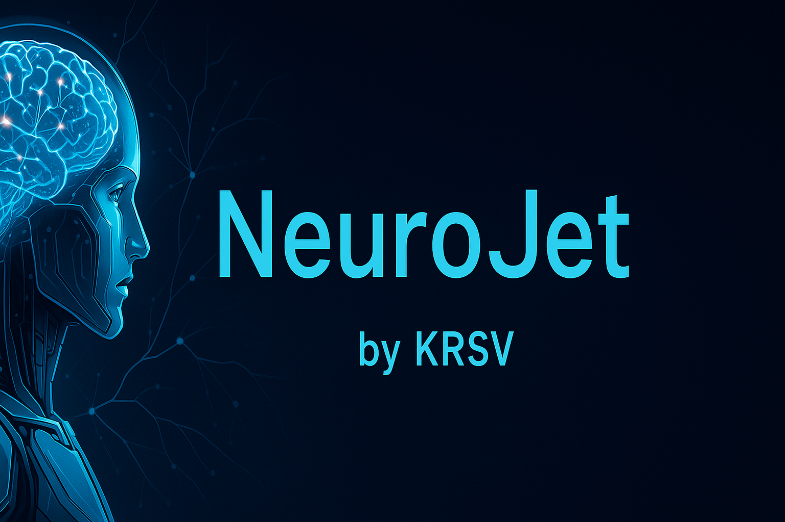
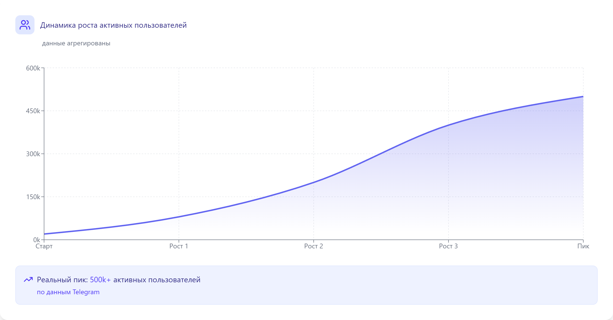
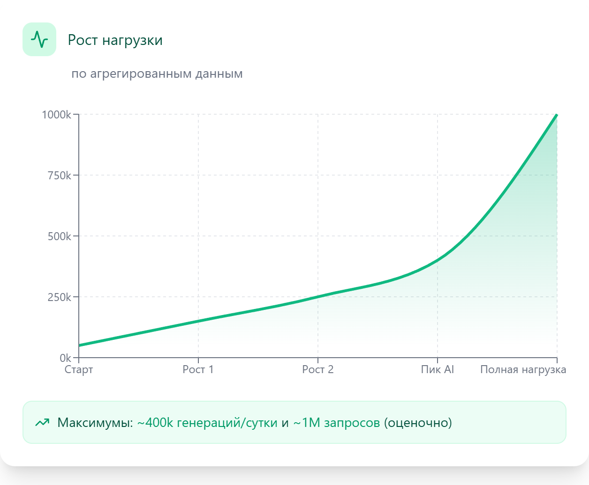
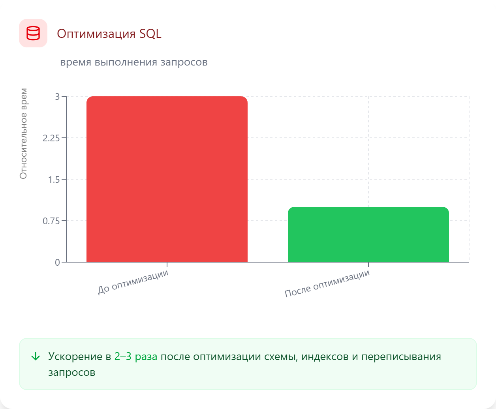
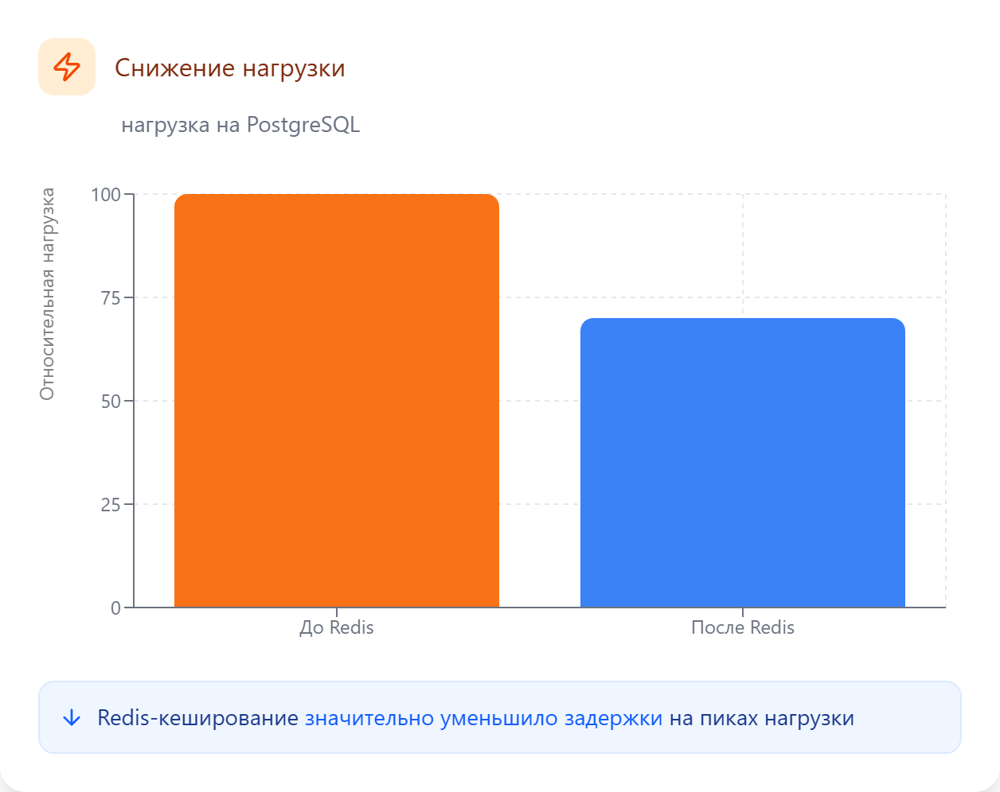
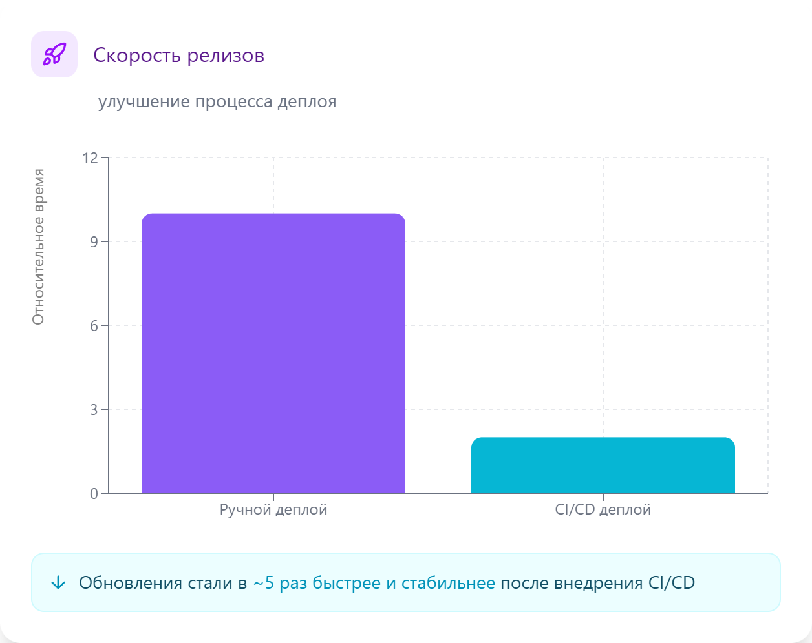

---

# ⭐ Краткое резюме

* 📲 Telegram-бот в сфере нейросетей, миллионы запросов ежедневно
* 🏗 Построение архитектуры с нуля → полноценная высоконагруженная система
* 🚀 Переход от монолита к микросервисам
* ⚙️ Оптимизация БД, тяжёлых SQL и схемы
* 🧠 Кеширование Redis, ускорение API, снижение нагрузки
* 🐳 Инфраструктура в Kubernetes, автоскейлинг
* 🔄 CI/CD, быстрые релизы, автоматизация окружений
* 🔥 Продакшн-миграции без даунтайма

> **Примечание:** показатели **500 000+ активных пользователей** и **1 000 000+ запросов в сутки** актуальны на момент моего сотрудничества с проектом. Текущие данные мне неизвестны.

---

# 📝 Описание репозитория

Этот репозиторий является **витриной (showcase)** моей работы над крупным коммерческим Telegram-ботом в сфере нейросетей.

Я работал с этим руководством примерно **1.5–2 года** над несколькими проектами, включая данный бот. Наше сотрудничество завершилось после того, как владельцы приняли решение продать бота другой стороне в связи с рисками возможной блокировки Telegram в РФ. После передачи продукта дальнейшая разработка перешла к внутренней команде нового владельца.

За время развития продукта у бота было как минимум **три версии**, и моя роль в них отличалась:

- 🟦 **Версия 1 (исходная)** — разработана предыдущим программистом; я занимался поддержкой, исправлением ошибок, добавлением новых фич и стабилизацией под рост нагрузки.  
- 🟩 **Версия 2 (переписанная мной)** — по решению владельцев продукт был полностью переписан: я спроектировал архитектуру, реализовал сервисы, оптимизировал БД и API, внедрил очереди, кеширование, CI/CD и инфраструктуру. Именно на этой версии были достигнуты показатели **500 000+ активных пользователей** и **1 000 000+ запросов в сутки** (на момент моего участия).  
- 🟦 **Версия 3 (моя улучшенная витринная)** — параллельно работе над второй версией и после неё я разработал собственную улучшенную версию бота: переработанная архитектура, улучшенная система ролей и взаимодействия с AI, оптимизированные сервисы и модель данных.  

Именно **третья, моя улучшенная версия** представлена здесь как showcase — она безопасна, не содержит коммерческого кода и демонстрирует мой уровень как инженера.

В этом репозитории вы найдёте:

* архитектуру улучшенной версии,
* ключевые технические решения,
* результаты оптимизаций,
* описание доменной модели,
* мой инженерный подход к проекту.

Исходный код хранится в приватном репозитории и по запросу может быть показан (read-only доступ или демонстрация по видеосвязи).

---

# 🚀 Описание проекта

Telegram-бот, использующий нейросети (генерация текста, изображений и др.), который:

* вырос до **500 000+ активных пользователей**,
* обрабатывал **1 000 000+ запросов в сутки**,
* требовал высокой производительности и отказоустойчивости.

## 🤖 Основные функции:

### **Генерация и обработка контента**

* генерация текста (ChatGPT-модели)
* создание изображений
* изменение и расширение изображений
* генерация похожих изображений
* транскрибация голосовых сообщений в текст

### **🧠 Система ролей для ChatGPT**

Полноценная социальная механика внутри бота:

* создание кастомных ролей (AI-агентов)
* редактирование инструкций и поведения роли
* публикация и обмен ролями через публичные ссылки
* каталог общедоступных ролей
* рейтинг ролей (оценки пользователей)
* удаление, восстановление, скрытие роли

Пользователи активно обменивались ролями, создавая экосистему AI-персонажей.

---

# 🏛 Архитектура (высокоуровневая диаграмма)

---

# ⚙️ Технологии проекта

| Область        | Технологии                                 |
| -------------- | ------------------------------------------ |
| Backend        | Python, FastAPI, Aiohttp, Asyncio, aiogram |
| БД             | PostgreSQL                                 |
| Кеш            | Redis                                      |
| Инфраструктура | Docker, Kubernetes (K8s), Helm             |
| Мониторинг     | Grafana, promtail, Loki                    |
| CI/CD          | GitHub Actions                             |
| DevOps         | Автоскейлинг, rollout-деплои               |

---

# 🎯 Мои обязанности

* Разработка архитектуры “с нуля”
* Интеграция Robokassa
* Разработка кода и написание тестов
* Оптимизация производительности и скорости API
* Проектирование и внедрение микросервисов
* Оптимизация PostgreSQL (схема, индексы, SQL)
* Внедрение Redis для кеширования и ускорения API
* Настройка Kubernetes, автоскейлинг, deployments
* Настройка CI/CD, автоматизация релизов
* Интеграция AI-сервисов
* Сложные миграции в продакшене без даунтайма

---

# 🛠 Проблемы и решения

### 🔧 Переход от монолита к микросервисам

**Проблема:** ожидание высокого трафика и сложность разработки в монолите.

**Решение:** переход на микросервисы и разделение сервисов по доменным областям.

**Результат:** независимые релизы, равномерное масштабирование.

---

### ⚙️ Оптимизация базы данных

**Проблема:** тяжёлые SQL-запросы тормозили API.

**Решение:** нормализация схемы таблиц, индексы, переписывание наиболее медленных запросов.

**Результат:** время выполнения ключевых запросов снизилось примерно в 2–3 раза, API стал стабильнее на высоких пиках.

---

### 🔥 Снижение нагрузки на БД

**Проблема:** перегрузка PostgreSQL при пиках.

**Решение:** кеширование горячих данных в Redis.

**Результат:** нагрузка на БД заметно снизилась, уменьшились задержки и рост таймаутов.

---

### 🚀 Медленные релизы

**Проблема:** ручные деплои были медленными и рискованными.

**Решение:** CI/CD на GitHub Actions.

**Результат:** релизы стали занимать несколько минут, появилось предсказуемое и стабильное выкативание.

---

### 🔒 Блокировка оплаты через Robokassa

**Проблема:** Telegram отключил сторонние платёжные системы.

**Решение:** временное отключение Robokassa и обход через транзитного бота.

**Результат:** восстановили возможность приема платежей через транзитного бота

---

### 🐳 Срочная миграция инфраструктуры

**Проблема:** внезапный уход единственного DevOps-инженера поставил систему под риск — инфраструктуру нужно было срочно перенести на новую платформу.

**Решение:** оперативная миграция всех сервисов, БД, очередей, балансировщиков и CI/CD на нового провайдера.

**Результат:** полный перенос продакшн-окружения без даунтайма, в крайне сжатые сроки.

---

# 🗄 Модель данных (в общих чертах)

* Пользователи API: логин, пароль, роли
* Пользователи бота: тариф, язык, баланс токенов, роль, активная модель
* Генерации текста: запрос, ответ, статус, модель
* Генерации изображений: запросы/ответы, статусы
* Чаты пользователей: имя, владелец, состояние
* Оплата: счета, статусы, суммы, методы
* Реферальные ссылки: владелец, тип
* Тарифы и цены: лимиты, стоимость
* Нейросети: типы, настройки, параметры
* Роли нейросети: имя, описание, инструкция, владелец
* Рейтинг ролей: оценка от пользователей

---

# 📈 Результаты проекта

> ⚠️ **Примечание:** Все приведённые ниже метрики соответствуют периоду моего участия в проекте. Текущее состояние продукта мне неизвестно.

### 🚀 Рост и производительность

* 500 000+ активных пользователей (на момент сотрудничества)
* ~1 000 000 запросов в сутки (оценочно, с учётом 400k генераций + сервисные запросы)

### ⚡ Оптимизация

* ускорены наиболее тяжёлые SQL-запросы (переписывание логики + индексы)
* стабилизировано время отклика API на пиках
* Redis существенно разгрузил PostgreSQL под высокой нагрузкой

### 🏗 Инфраструктура

* Kubernetes обеспечил автоскейлинг и отказоустойчивость
* CI/CD позволил выпускать обновления за считаные минуты вместо ручных действий

### 🔒 Надёжность

* Миграции в продакшене выполнялись без даунтайма.

---

# 🔭 Дальнейшие улучшения

* добавление новых моделей нейросетей
* внедрение AI-агентов
* рефакторинг старого кода
* покрытие тестами (80% pytest)
* улучшение документации
* улучшение биллинга через транзитного бота

---

# 🔐 Доступ к исходному коду

Исходный код хранится в приватном репозитории. По запросу могу предоставить:

* read-only доступ
* демонстрацию кода по видеосвязи

---

# 📞 Контакты

* Telegram: [@kurashevmichael](https://t.me/kurashevmichael)
* Email: [kurashevmichael@gmail.com](mailto:kurashevmichael@gmail.com)

