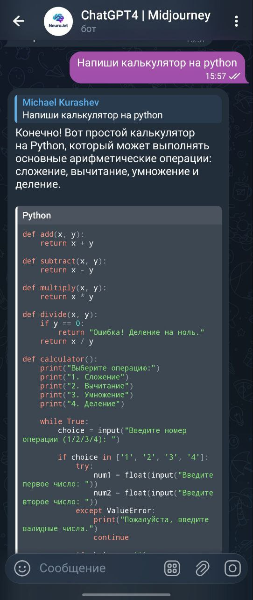
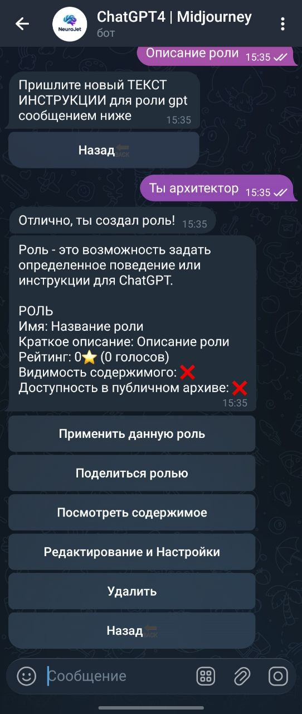
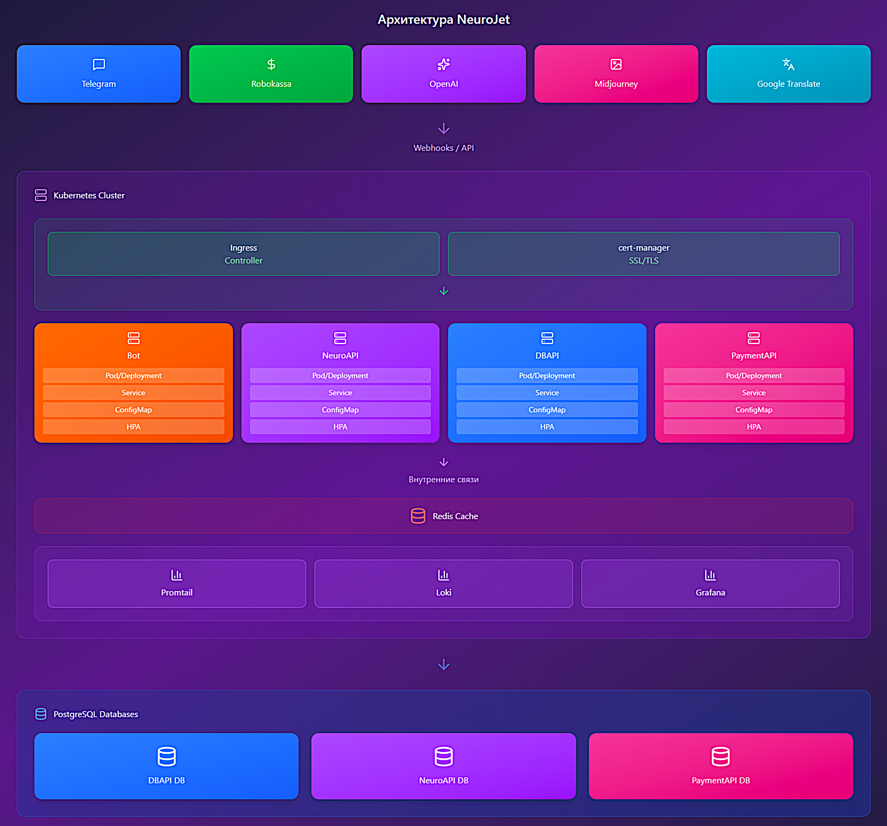
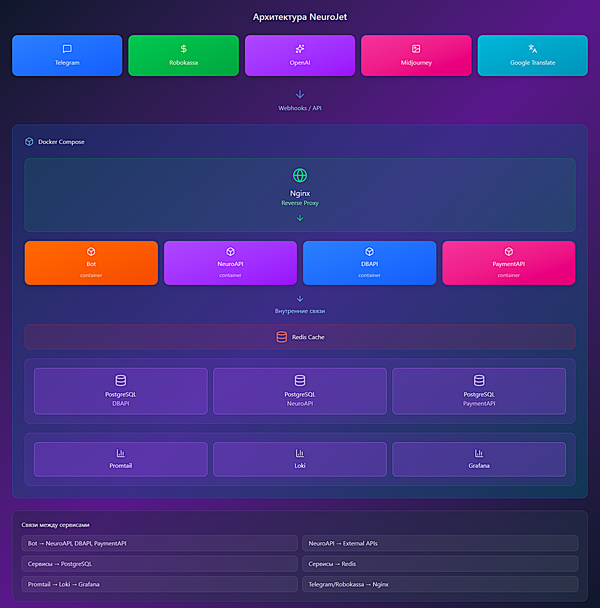

---

# ⭐ Краткое резюме

* 📲 AI/LLM-платформа (Telegram-бот + WebApp), 5 млн. пользователей, 500 000+ активных пользователей (MAU), 500 000+ генераций ежедневно
* 🏗 Построение архитектуры с нуля
* 🚀 Инициализация декомпозиции монолита на сервисы (LLM generatin, billing, core backend)
* ⚙️ Оптимизация (переработка запросов бд, индексы, корректировки схемы данных, кэширование)
* 📪 Ассинхронное взаимодействие сервисов через RabbitMQ
* 🐳 Инфраструктура в Kubernetes, автоскейлинг
* 🔄 CI/CD, быстрые релизы, автоматизация окружений
* 🔥 Продакшн-миграции без даунтайма

> **Примечание:** показатели **500 000+ активных пользователей** и **500 000+ генераций в сутки** актуальны на момент моего сотрудничества с проектом. Текущие данные мне неизвестны.

---

# 📝 Описание репозитория

Этот репозиторий является **витриной (showcase)** моей работы над крупной AI/LLM-платформой. В нем вы найдёте:

* архитектуру,
* ключевые технические решения,
* результаты оптимизаций,
* описание доменной модели,
* мой инженерный подход к проекту.

---

# 🚀 Описание проекта

NeuroJet - это AI/LLM-платформа, агрегирующая нейросети Claude, ChatGPT, Midjourney и др. для генерации текста, изображений, файлов, которая выросла до **500 000+ активных пользователей** и обрабатывала **500 000+ генераций в сутки**.

  
  
  

## 🤖 Основные функции:

### **Генерация и обработка контента**

* генерация текста (ChatGPT-модели)
* создание изображений
* изменение и расширение изображений
* генерация похожих изображений
* транскрибация голосовых сообщений в текст

### **🧠 Система ролей для ChatGPT**

Полноценная социальная механика внутри бота:

* создание кастомных ролей (AI-агентов)
* редактирование инструкций и поведения роли
* публикация и обмен ролями через публичные ссылки
* каталог общедоступных ролей
* рейтинг ролей (оценки пользователей)
* удаление, восстановление, скрытие роли

Пользователи активно обменивались ролями, создавая экосистему AI-персонажей.

---

# 🏛 Архитектура (высокоуровневая диаграмма)

## Prod version

## Dev version

---

# ⚙️ Технологии проекта

| Область        | Технологии                                 |
| -------------- | ------------------------------------------ |
| Backend        | Python, FastAPI, Aiohttp, Asyncio, aiogram |
| БД             | PostgreSQL                                 |
| Кеш            | Redis                                      |
| Инфраструктура | Docker, Kubernetes (K8s), Helm             |
| Мониторинг     | Grafana, promtail, Loki                    |
| CI/CD          | GitHub Actions                             |
| DevOps         | Автоскейлинг, rollout-деплои               |

---

# 🎯 Мои обязанности

* Разработка архитектуры “с нуля”
* Интеграция Robokassa
* Разработка кода и написание тестов
* Оптимизация производительности и скорости API
* Проектирование и внедрение микросервисов
* Оптимизация PostgreSQL (схема, индексы, SQL)
* Внедрение Redis для кеширования и ускорения API
* Настройка Kubernetes, автоскейлинг, deployments
* Настройка CI/CD, автоматизация релизов
* Интеграция AI-сервисов
* Сложные миграции в продакшене без даунтайма

---

# 🛠 Проблемы и решения

### 🔧 Переход от монолита к микросервисам

**Проблема:** ожидание высокого трафика и сложность разработки в монолите.

**Решение:** переход на микросервисы и разделение сервисов по доменным областям.

**Результат:** независимые релизы, равномерное масштабирование.

---

### ⚙️ Оптимизация базы данных

**Проблема:** тяжёлые SQL-запросы тормозили API.

**Решение:** нормализация схемы таблиц, индексы, переписывание наиболее медленных запросов.

**Результат:** время выполнения ключевых запросов снизилось примерно в 2–3 раза, API стал стабильнее на высоких пиках.

---

### 🔥 Снижение нагрузки на БД

**Проблема:** перегрузка PostgreSQL при пиках.

**Решение:** кеширование горячих данных в Redis.

**Результат:** нагрузка на БД заметно снизилась, уменьшились задержки и рост таймаутов.

---

### 🚀 Медленные релизы

**Проблема:** ручные деплои были медленными и рискованными.

**Решение:** CI/CD на GitHub Actions.

**Результат:** релизы стали занимать несколько минут, появилось предсказуемое и стабильное выкативание.

---

### 🔒 Блокировка оплаты через Robokassa

**Проблема:** Telegram отключил сторонние платёжные системы.

**Решение:** временное отключение Robokassa и обход через транзитного бота.

**Результат:** восстановили возможность приема платежей через транзитного бота

---

### 🐳 Срочная миграция инфраструктуры

**Проблема:** внезапный уход единственного DevOps-инженера поставил систему под риск — инфраструктуру нужно было срочно перенести на новую платформу.

**Решение:** оперативная миграция всех сервисов, БД, очередей, балансировщиков и CI/CD на нового провайдера.

**Результат:** полный перенос продакшн-окружения без даунтайма, в крайне сжатые сроки.

---

# 🗄 Модель данных (в общих чертах)

* Пользователи API: логин, пароль, роли
* Пользователи бота: тариф, язык, баланс токенов, роль, активная модель
* Генерации текста: запрос, ответ, статус, модель
* Генерации изображений: запросы/ответы, статусы
* Чаты пользователей: имя, владелец, состояние
* Оплата: счета, статусы, суммы, методы
* Реферальные ссылки: владелец, тип
* Тарифы и цены: лимиты, стоимость
* Нейросети: типы, настройки, параметры
* Роли нейросети: имя, описание, инструкция, владелец
* Рейтинг ролей: оценка от пользователей

---

# 📈 Результаты проекта

> ⚠️ **Примечание:** Все приведённые ниже метрики соответствуют периоду моего участия в проекте. Текущее состояние продукта мне неизвестно.

### 🚀 Рост и производительность

* 500 000+ активных пользователей
* ~500 000 генераций в сутки

### ⚡ Оптимизация

* ускорены наиболее тяжёлые SQL-запросы (переписывание логики + индексы)
* стабилизировано время отклика API на пиках
* Redis существенно разгрузил PostgreSQL под высокой нагрузкой

### 🏗 Инфраструктура

* Kubernetes обеспечил автоскейлинг и отказоустойчивость
* CI/CD позволил выпускать обновления за считаные минуты вместо ручных действий

### 🔒 Надёжность

* Миграции в продакшене выполнялись без даунтайма.

---

# 🔭 Дальнейшие улучшения

* добавление новых моделей нейросетей
* внедрение AI-агентов
* рефакторинг старого кода
* покрытие тестами (80% pytest)
* улучшение документации
* улучшение биллинга через транзитного бота
* внедрение Kafka для перехода от REST-взаимодействия между сервисами к event-driven архитектуре, что позволит ускорить обработку задач, снизить нагрузку на API и обеспечить масштабируемый обмен событиями между микросервисами.

---

# 🔐 Доступ к исходному коду

Исходный код хранится в приватном репозитории. По запросу могу предоставить:

* read-only доступ
* демонстрацию кода по видеосвязи

---

# 📞 Контакты

* Telegram: [@kurashevmichael](https://t.me/kurashevmichael)
* Email: [kurashevmichael@gmail.com](mailto:kurashevmichael@gmail.com)

